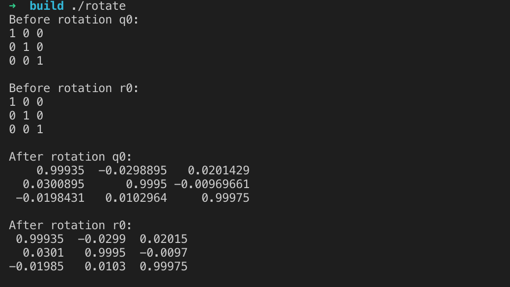

# $$Lesson 1$$
$$rrison$$
## 1 VIO文献阅读
阅读VIO相关综述文献，回答以下问题：
###视觉与IMU进行融合之后有何优势？
IMU快速响应(100-2000Hz),不受成像质量影响,角速度估计准确,可估计绝对尺度(加速度计有物理意义)。适合短时间、快速的运动；
摄像头不产生漂移。适合长时间慢速的运动。
在快速转动时，摄像头容易跟丢，IMU可以帮助估计瞬时姿态；
摄像头可以回环检测，抑制IMU纠正漂移。
###有哪些常见的视觉+IMU融合方案？有没有工业界应用的例子？
- MSCKF是基于卡尔曼滤波器的双目视觉里程计。把多帧图像的相机位姿加入卡尔曼状态向量中，MSCKF维护一个位姿的FIFO，按照时间顺序排列，可以称为滑动窗口，一个特征点在滑动窗口的几个位姿都被观察到的话，就会在这几个位姿间建立约束，从而进行KF的更新。MSCKF的优点在于鲁棒性高，计算复杂度低，缺点是无法用到全局的信息进行全局的优化，没有回环检测。

- VINS-mono是基于优化和滑动窗口的VIO，使用IMU预积分构建紧耦合框架。并且具备自动初始化，在线外参标定，重定位，闭环检测，以及全局位姿图优化功能。
- OKVIS利用非线性优化一个滑窗内的关键帧，其损失函数包括带权重的投影差和带权重的惯导误差。OKVIS的前端是利用多尺度Harris提取特征点，并用BRISK作为描述子。OKVIS的后端是利用Google Ceres完成的，通过非线性优化完成状态估计。

VIO工业界产品有Google tango手机，Apple的ARKit，Qualcomm骁龙XR1平台。
###在学术界，VIO研究有哪些新进展？有没有将学习方法用到VIO中的例子
- CVI-SLAM – Collaborative Visual-Inertial SLAM, Marco Karrer, Patrik Schmuck, Margarita Chli. 用多个机器人同步更新地图
- VINet: Visual-Inertial Odometry as a Sequence-to-Sequence Learning Problem。VINet利用FlowNet+RNN结合来做VIO。它的整个网络可以分为三部分。CNN部分通过一个FlowNet来得到相邻帧间图像间的光流运动特征(1024维)。接着用LSTM来处理IMU的原始数据，得到IMU数据下的运动特征。最后，对视觉运动特征和IMU运动特征做一个结合，送入另一个LSTM网络进行特征融合和位姿估计。
- Online Temporal Calibration for Monocular Visual-Inertial Systems. 时间戳标定。算法假设IMU和相机之间的延迟是常数, 将IMU和相机之间的时间延迟, 变成图像平面特征检测的位置的延迟。

## 2 四元数和李代数更新
见rotate/
程序输出结果：

## 3 使用右乘，推导以下导数$\frac{d(R^{-1} p)}{dR}, \frac{dln(R_1 R_2^{-1})^{\vee}}{dR_2}$

$\frac{d(R^{-1}p)}{dR}$
$= \lim_{\phi\to 0}\frac{(Re^{\phi^{\land}})^{-1}p-R^{-1}p}{\phi}$
$= \lim_{\phi\to 0}\frac{e^{-\phi^{\land}}R^{-1}p-R^{-1}p}{\phi}$
$= \lim_{\phi\to 0}\frac{(I-\phi^{\land}R^{-1}p-R^{-1}p}{\phi}$
$= \lim_{\phi\to 0}\frac{-\phi^{\land}R^{-1}p}{\phi}$
$= \lim_{\phi\to 0}\frac{-\phi^{\land}R^{-1}p}{\phi}$
$= \lim_{\phi\to 0}\frac{(R^{-1}p)^{\land}\phi}{\phi}$
$= (R^{-1}p)^{\land}$

$\frac{dln(R_1 R_2^{-1})^{\vee}}{dR_2}$
$=\lim_{\phi\to 0}\frac{ln(R_{1}(R_{2}e^{\phi^{\wedge}})^{-1})^{\vee}-ln(R_1 R_2^{-1})^{\vee}}{\phi}$
$=\lim_{\phi\to 0}\frac{ln(R_{1}e^{-\phi^{\wedge}}R_2^{-1})^{\vee}-ln(R_1 R_2^{-1})^{\vee}}{\phi}$
$=\lim_{\phi\to 0}\frac{ln(R_{1}R_2^{-1}R_2 e^{-\phi^{\wedge}}R_2^{-1})^{\vee}-ln(R_1 R_2^{-1})^{\vee}}{\phi}$
$=\lim_{\phi\to 0}\frac{ln(R_{1}R_2^{-1} e^{(-R_2 \phi)^{\wedge}})^{\vee}-ln(R_1 R_2^{-1})^{\vee}}{\phi}$
$=\lim_{\phi\to 0}\frac{ln(R_{1}R_2^{-1} + J_r^{-1}(ln(R_1 R_2^{-1})^{\vee})(-R_2 \phi)-ln(R_1 R_2^{-1})^{\vee}}{\phi}$
$=-J_r^{-1}(ln(R_1 R_2^{-1})^{\vee})R_2$

已知
$ln(Re^{\phi^{\wedge}})^{\vee}=ln(R )^{\vee}+J_r^{-1}\phi$

$J_r^{-1}(\theta \omega)=\frac{\theta}{2}cot(\frac{\theta}{2})I+(1-\frac{\theta}{2}cot(\frac{\theta}{2}))\omega\omega^T+\frac{\theta}{2}\omega^{\wedge}$

$R^T e^{\phi^{\wedge}}R=e^{(R^T \phi)^{\wedge}}$