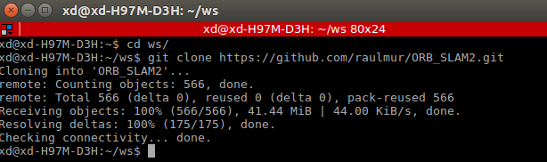
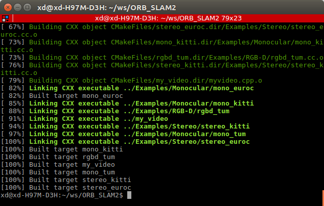

# Lecture 1
## 2.1 安装软件
```
sudo apt-get install <var>
```
安装路径一般在/usr/share  
## 2.2 环境变量
环境变量是PATH；  
添加环境变量：
```
export PATH = <var>:$PATH
```
## 2.3 根目录的目录结构
- /home 用户目录;
- /dev 系统设备文件;
- /etc 系统配置文件；
- /sbin 系统管理命令  

## 2.4 给a.sh添加可执行权限：
```
chmod +x a.sh
```  
## 2.5 修改所有者：
```
chmown xiang:xiang a.sh
```
## 3.1 应用场景
- 自动驾驶
- 3D重建
- 增强现实
- 无人机建图，定位

## 3.2 定位与建图的关系
准确的定位需要精确的地图，精确的地图来自于准确的定位  
因为只有建立好地图才能更好的定位  
## 3.3 SLAM发展历程
- 史前时期 根据已知地图来定位
- EKF主流 1990-2005，用EKF模型求解SLAM  
- BA转型时期 2006 - 2010
- 前沿研究，更多的传感器，更复杂的环境

## 3.4 经典文献
- D. Scaramuzza, F. Fraundorfer, "Visual Odometry: Part I - The First 30 Years and Fundamentals IEEE Robotics and Automation Magazine", Volume 18, issue 4, 2011.
- F. Fraundorfer and D. Scaramuzza, "Visual Odometry : Part II: Matching, Robustness, Optimization, and Applications," in IEEE Robotics & Automation Magazine, vol. 19, no. 2, pp. 78-90, June 2012.
- Stephan Weiss and Roland Siegwart. Real-Time Metric State Estimation for Modular Vision-Inertial Systems. in IEEE International Conference on Robotics and Automation (ICRA), 2011.
- Dorian Gálvez-López and Juan D. Tardós. Bags of Binary Words for Fast Place Recognition in Image Sequences. IEEE Transactions on Robotics, vol. 28, no. 5, pp. 1188-1197, 2012.

## 4 CMAKE
见sayhello文件夹

## 5.1 下载ORB_SLAM2代码

## 5.2
- (a) shared library lib/libORB_SLAM2.so, executable files:rgbd_tum, stero_kitti,  mono_tum, my_video, stereo_euroc, mono_euroc, mono_kitti  
- (b) include/包含了头文件；src/包含了局部建图，回环检测，跟踪；Examples/包含了单目，双目，RGBD摄像头的运行样例
- (c) ldd rgbd_tum  
linux-vdso.so.1
libORB_SLAM2.so
libopencv_imgcodecs.so.3.3
libopencv_core.so.3.3
libpangolin.so
libGL.so.1
libstdc++.so.6
libgcc_s.so.1
libc.so.6
libDBoW2.so
libg2o.so
libopencv_calib3d.so.3.3
libopencv_cudawarping.so.3.3
libopencv_features2d.so.3.3
libopencv_highgui.so.3.3
libopencv_imgproc.so.3.3
libpthread.so.0
libm.so.6
libjpeg.so.8
libwebp.so.5
libpng16.so.16
libjasper.so.1
libIlmImf-2_2.so.22
libHalf.so.12
libz.so.1
libdl.so.2
librt.so.1
libtbb.so.2
libcudart.so.8.0
libopenblas.so.0
libGLEW.so.1.13
libX11.so.6
libpython3.5m.so.1.0
libdc1394.so.22
libavcodec-ffmpeg.so.56
libavformat-ffmpeg.so.56
libavutil-ffmpeg.so.54
libswscale-ffmpeg.so.3
libOpenNI.so.0
libpng12.so.0
/lib64/ld-linux-x86-64.so.2
libnvidia-tls.so.384.90
libnvidia-glcore.so.384.90
libXext.so.6
libopencv_flann.so.3.3
libgomp.so.1
libnppc.so.8.0
libnppig.so.8.0
libmvec.so.1
libQt5Test.so.5
libQt5OpenGL.so.5
libQt5Widgets.so.5
libQt5Gui.so.5
libQt5Core.so.5
libIex-2_2.so.12
libIlmThread-2_2.so.12
libgfortran.so.3
libxcb.so.1
libexpat.so.1
libutil.so.1
libraw1394.so.11
libusb-1.0.so.0
libswresample-ffmpeg.so.1
libva.so.1
libzvbi.so.0
libxvidcore.so.4
libx265.so.79
libx264.so.148
libwavpack.so.1
libvpx.so.3
libvorbisenc.so.2
libvorbis.so.0
libtwolame.so.0
libtheoraenc.so.1
libtheoradec.so.1
libspeex.so.1
libsnappy.so.1
libshine.so.3
libschroedinger-1.0.so.0
libopus.so.0
libopenjpeg.so.5
libmp3lame.so.0
libgsm.so.1
libcrystalhd.so.3
liblzma.so.5
libssh-gcrypt.so.4
librtmp.so.1
libmodplug.so.1
libgme.so.0
libbluray.so.1
libgnutls.so.30
libbz2.so.1.0
libtinyxml.so.2.6.2
libgobject-2.0.so.0
libgthread-2.0.so.0
libglib-2.0.so.0
libicui18n.so.56
libicuuc.so.56
libicudata.so.56
libquadmath.so.0
libXau.so.6
libXdmcp.so.6
libudev.so.1
libsoxr.so.0
libnuma.so.1
libogg.so.0
liborc-0.4.so.0
libgcrypt.so.20
libgssapi_krb5.so.2
libhogweed.so.4
libnettle.so.6
libgmp.so.10
libxml2.so.2
libfontconfig.so.1
libfreetype.so.6
libp11-kit.so.0
libidn.so.11
libtasn1.so.6
libffi.so.6
libpcre.so.3
libgpg-error.so.0
libkrb5.so.3
libk5crypto.so.3
libcom_err.so.2
libkrb5support.so.0
libicuuc.so.55
libkeyutils.so.1
libresolv.so.2
libicudata.so.55

## 6.1 compile ORB_SLAM2

## 6.2 add my_video to ORB_SLAM2
在CMakeLists.txt后面添加
```
set(CMAKE_RUNTIME_OUTPUT_DIRECTORY ${PROJECT_SOURCE_DIR})
add_executable(my_video
myvideo.cpp)
target_link_libraries(my_video ${PROJECT_NAME})
```
## 6.2 运行截图

