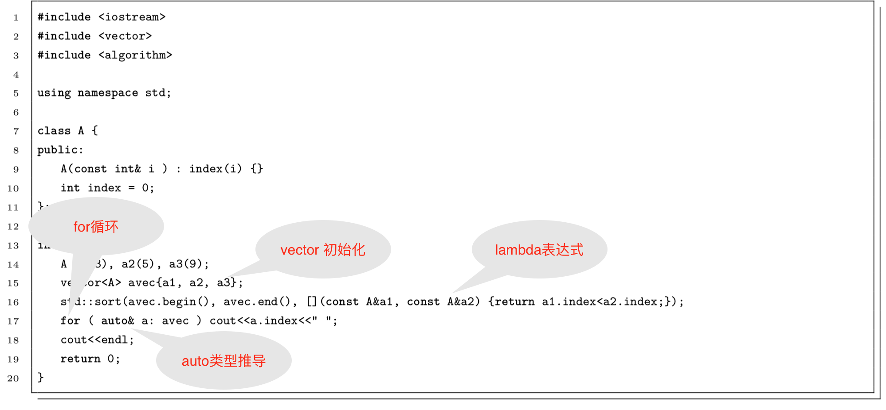

# $$Lecture 2$$
$$rrison$$
- 2.1 $ Ax=b $,有且只有一个解的条件是$rank(A)=rank([A\ b])=未知解的个数$
- 2.2 高斯消元法的原理是通过初等行变换把$A$变换为上三角矩阵，然后递归的求解未知量
- 2.3 QR分解的原理是把$A$分解成正交矩阵$Q$和上三角矩阵$R$的乘积。然后最小化欧几里得范数：$min(\Vert Ax-b \Vert)$，左乘正交矩阵$Q^'$，$min(\Vert Q^{'}QRx-Q^{'}b \Vert)=min(\Vert Rx-Q^{'}b\Vert)$
- 2.4 Cholesky 分解把矩阵分解为一个下三角矩阵及其共轭转置矩阵的乘积，$A=LL^*$.
- 2.5 见matrix_decomp文件夹

---
3 见calc_quat文件夹

---
4 证明罗德里格斯公式 $R=cos\theta\cdot I+(1-cos\theta)nn^T+sin\theta\cdot \hat{n}$
已知三重叉乘公式：
$$a\times (b \times c) = (a\cdot c)\cdot b - (a \cdot b)\cdot c \tag{1}$$
证明公式(1):
$(a\times (b \times c))_x = (a\cdot c)\cdot b_x - (a\cdot b)\cdot c_x $  
$(a\times (b \times c))_x = (a\cdot c)\cdot b_y - (a\cdot b)\cdot c_y $  
$(a\times (b \times c))_x = (a\cdot c)\cdot b_z - (a\cdot b)\cdot c_z $  
可以得到公式(1).

设$n$为旋转轴的单位向量，$v$为任意一个被$n$旋转了$\theta$角度的向量，那么$v$可以分解为两个平行于$n$和垂直于$n$的向量，$v_{\Vert}$和$v_{\perp}$，有$v=v_{\Vert}+v_{\perp}$.
那么$v_{\Vert}=(v\cdot n)\cdot n \tag{2}$
由公式(1)可得，$v_{\perp}=v-v_{\Vert}=v-(v \cdot k)\cdot k = -k\times(k\times v)$
我们知道，旋转的时候$v_{\Vert}$保持不变，而$v_{\perp}$转过$\theta$角度，得到
$v_{\Vert}^{rot}=v_{\Vert}$
$v_{\perp}^{rot} = cos\theta \cdot v_{\perp} + sin\theta \cdot(n\times v_{\perp})=cos\theta \cdot v_{\perp} + sin\theta \cdot(n\times v)$

$v^{rot}=v_{\Vert}^{rot}+v_{\perp}^{rot}$
$=v_{\Vert}+cos\theta \cdot v_{\perp} + sin\theta \cdot(n\times v)$
$=v_{\Vert}+cos\theta \cdot (v-v_{\Vert}) + sin\theta \cdot(n\times v)$
$=cos\theta \cdot v+(1-cos\theta) \cdot v_{\Vert}+sin\theta \cdot(n\times v)$
$=cos\theta \cdot v+(1-cos\theta) \cdot n\cdot(n\cdot v)+sin\theta \cdot(n\times v)$
另外对于旋转矩阵，$v^{rot}=R\cdot v$，并且$n\times v$可以改写成反对称矩阵的形式$\hat{n}\ \ \cdot v$，
那么$R\cdot v=cos\theta \cdot v+(1-cos\theta) \cdot n\cdot(n\cdot v)+sin\theta \cdot(\hat{n}\ \ \cdot v)$
得到$R=cos\theta\cdot I+(1-cos\theta)nn^T+sin\theta\cdot \hat{n}$

---
5 四元数运算性质
假设$p=[0,a,b,c]^T$,$q=[q_0,q_1,q_2,q_3]^T$,$p^{\prime}=[0,a^{\prime},b^{\prime},c^{\prime}]^T$
已知对于四元数有$p^{\prime}=q\cdot p\cdot q^{\prime}$；
对于旋转矩阵有 $[a^{\prime},b^{\prime},c^{\prime}]^T=R\cdot[a,b,c]^T$。
可知$
 \begin{bmatrix}
   I & 0^T\\\\
   0 & R
  \end{bmatrix}\cdot p = p^{\prime}
$，得到$Q=\begin{bmatrix}
   I & 0^T\\\\
   0 & R
  \end{bmatrix}=\begin{bmatrix}
   1 & 0 & 0 & 0\\\\
   0 & 1-2q_2^2-2q_3^2 & 2q_1q_2-2q_0q_3 & 2q_1q_3+2q_0q_1 \\\\
   0 & 2q_1q_2+2q_0q_3 & 1-2q_1^2-2q_3^2 & 2q_2q_3-2q_0q_1 \\\\
   0 & 2q_1q_3-2q_0q_2 & 2q_2q_3+2q_0q_1 & 1-2q_1^2-2q_2^2
  \end{bmatrix}$
  ---
  6 C++11新特性
  