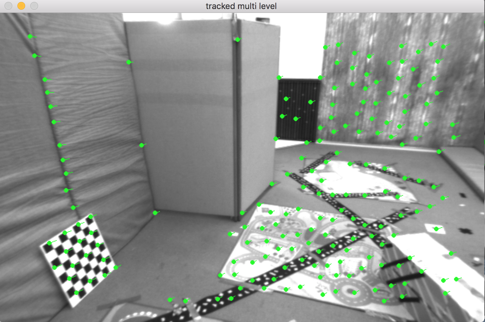
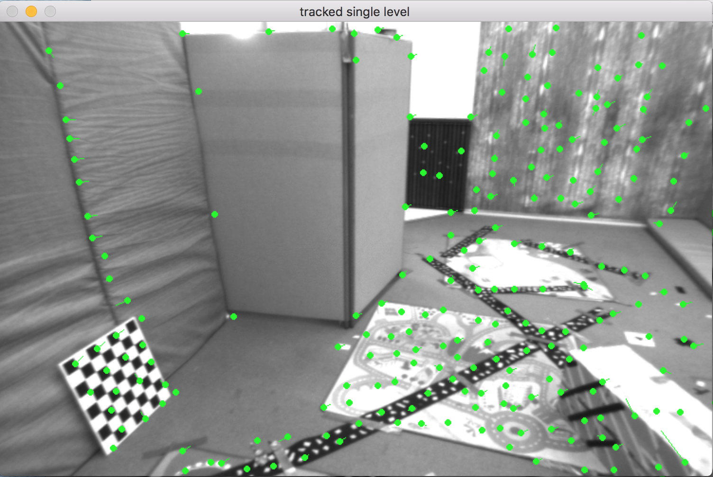
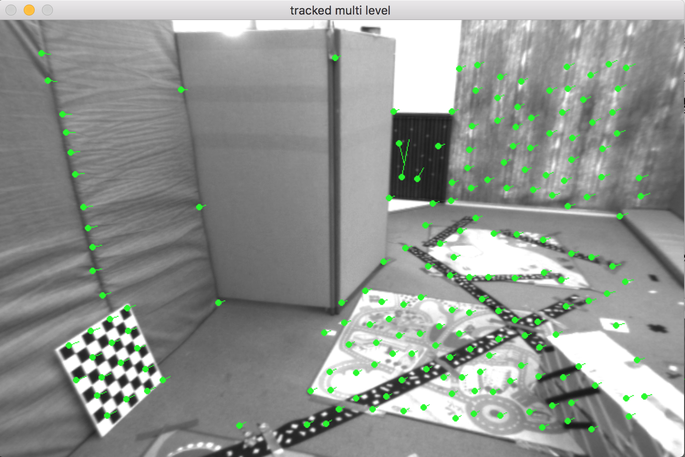
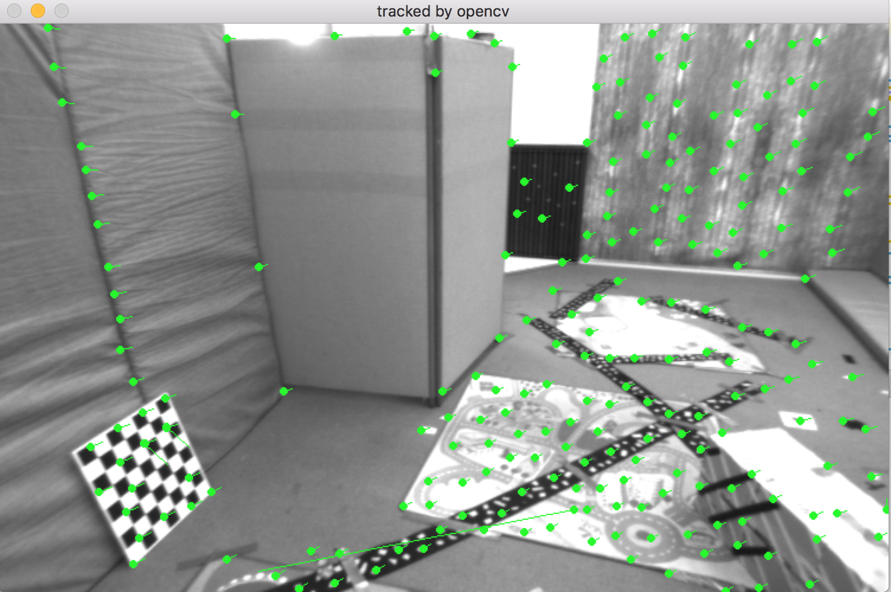

# $$Lecture 6$$
$$rrison$$
## 2 LK光流
### 2.1 文献综述
1. **光流法可分为哪几类?**  
How parameters update: additive approach or compositional approach  
Direction of parameter estimation: forward or inverse  
2. **在 compositional 中，为什么有时候需要做原始图像的 wrap?该 wrap 有何物理意义?**  
re-parameterize the warps to ensure that W(x; 0) = x.  
3. **forward 和 inverse 有何差别?**  
difference is the direction of the parameters estimation

### 2.2, 2,3
见code/optical_ ow.cpp
### 2.4 推广至金字塔
单层正向

单层反向

金字塔正向

金字塔反向

opencv

1. **所谓 coarse-to-fine 是指怎样的过程?**  
降采样图像，建立图像金字塔。从最小图像开始匹配图像，直到匹配到原始图像。
2. **光流法中的金字塔用途和特征点法中的金字塔有何差别?**  
特征点金字塔是为了解决特征点的尺度问题；光流法金字塔是为了解决图像的非凸性，便于优化求解。

### 2.5 讨论
1. **我们优化两个图像块的灰度之差真的合理吗?哪些时候不够合理?你有解决办法吗?**  
灰度容易受曝光等参数的影响；可以做重校准，设好参数
2. **图像块大小是否有明显差异?取 16x16 和 8x8 的图像块会让结果发生变化吗?**  
图像块变大会使得效果好一些。
3. **金字塔层数对结果有怎样的影响?缩放倍率呢?**  
缩放率0.5不需要插值，层数=分辨率被2整除的次数，越多越好。

## 3 直接法
### 3.1, 3.2
见code/direct_method.cpp
### 3.3
1. **直接法是否可以类似光流，提出 inverse, compositional 的概念?它们有意义吗?**  
不需要，直接法的位姿估计已经包含了上述过程。
2. **请思考上面算法哪些地方可以缓存或加速?**  
patch可以缓存,每一层金字塔可以只对上一次匹配好的点进行匹配
3. **在上述过程中，我们实际假设了哪两个 patch 不变?**  
源图的patch跟转换位姿后的patch的灰度不变
4. **为何可以随机取点?而不用取角点或线上的点?那些不是角点的地方，投影算对了吗?**  
直接法只需要有灰度梯度就可以工作，线上的点灰度相同，容易匹配出错。
5. **请总结直接法相对于特征点法的异同与优缺点。**  
直接法不需要提取特征点，可以在特征缺失的情况下工作，可以构建稠密地图。直接法非常依赖目标函数的凸性，只有在移动非常小的情况表现得好。

## 4 使用光流计算视差
见code/disparity.cpp